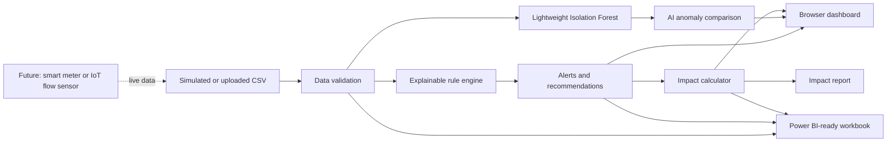

# AquaSave AI Architecture

## Data flow

1. A user uploads hourly water-use data, or the project uses its simulation dataset.
2. The rule engine finds continuous overnight flow and unusually high hour-specific usage.
3. The Isolation Forest scores unusual records against a generated normal baseline.
4. The dashboard shows alerts, source-based recommendations, and conservation scenarios.
5. The impact calculator estimates water, cost, pumping energy, and CO2 savings.
6. The Power BI workbook and project report reuse the same calculated results.
